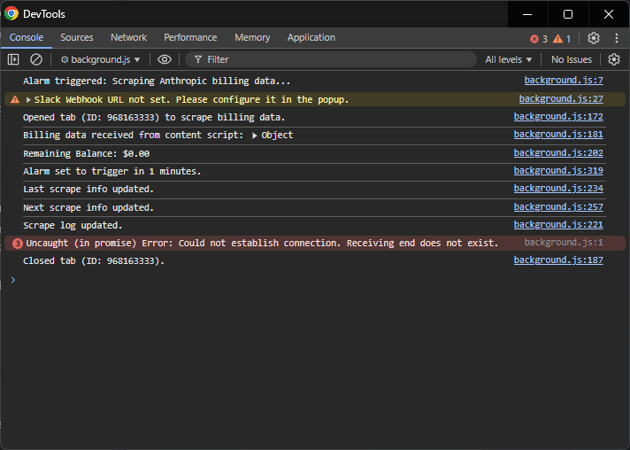

# Anthropic Billing Tracker


**Version:** 1.0.0  
**Author:** Bug-Finderr  
**License:** MIT

---

## Table of Contents

- [Introduction](#introduction)
- [Features](#features)
- [Prerequisites](#prerequisites)
- [Installation](#installation)
- [Setup Guide](#setup-guide)
  - [1. Obtain Your Slack Webhook URL](#1-obtain-your-slack-webhook-url)
  - [2. Configure the Extension](#2-configure-the-extension)
    - [a. Add Slack Webhook URL](#a-add-slack-webhook-url)
    - [b. Add Balance Thresholds](#b-add-balance-thresholds)
    - [c. Start Scraping](#c-start-scraping)
- [Using the Extension](#using-the-extension)
  - [Popup Interface](#popup-interface)
  - [Options Page - Viewing Logs](#options-page---viewing-logs)
- [Monitoring and Troubleshooting](#monitoring-and-troubleshooting)
- [Upcoming Changes](#upcoming-changes)
- [Contributing](#contributing)
- [License](#license)
- [Acknowledgements](#acknowledgements)

---

## Introduction

Welcome to **Anthropic Billing Tracker**! This Chrome extension monitors your Anthropic billing balance and sends real-time alerts to your Slack channel when your balance reaches predefined thresholds. Stay informed and never run out of credits again!

---

## Features

- **Real-Time Monitoring:** Continuously monitors your Anthropic billing balance.
- **Customizable Thresholds:** Define multiple balance limits and corresponding alert intervals.
- **Slack Integration:** Sends alerts directly to your Slack channel via Webhooks.
- **Comprehensive Logs:** Keeps a log of all scraping actions accessible through the Options Page.
- **User-Friendly Interface:** Easily configure settings through the Popup and manage logs via the Options Page.
- **Cross-Platform Support:** Works seamlessly on Chrome browsers across macOS, Windows, Linux, and Chrome OS.

---

## Prerequisites

Before installing the **Anthropic Billing Tracker**, ensure you have:

- **Google Chrome Browser:** The latest version is recommended.
- **Slack Workspace:** To receive billing alerts via Slack.

---

## Installation

1. **Download the Extension Files:**

   - Clone the repository or download the ZIP file containing the extension files.

2. **Add the Extension to Chrome:**

   - Open Google Chrome.
   - Navigate to `chrome://extensions/`.
   - Enable **Developer mode** by toggling the switch in the top right corner.
   - Click on **"Load unpacked"**.
   - Select the directory where the extension files are located.

3. **Verify Installation:**

   - After loading, you should see the **Anthropic Billing Tracker** icon in your Chrome toolbar.

---

## Setup Guide

### 1. Obtain Your Slack Webhook URL

To enable Slack notifications, you'll need to obtain a **Slack Webhook URL**. Follow these steps:

1. **Navigate to Slack API Webhooks:**

   - Visit the [Slack Incoming Webhooks](https://api.slack.com/messaging/webhooks) page.

2. **Create a New Webhook:**

   - Click on **"Create Your Slack App"**.
   - Choose **"From scratch"** and provide an **App Name** and select your **Development Slack Workspace**.
   - Click **"Create App"**.

3. **Enable Incoming Webhooks:**

   - In the left sidebar, select **"Incoming Webhooks"**.
   - Toggle the **"Activate Incoming Webhooks"** switch to **ON**.

4. **Add a New Webhook to Workspace:**

   - Click on **"Add New Webhook to Workspace"**.
   - Select the **channel** where you want to receive alerts and click **"Allow"**.

5. **Copy the Webhook URL:**

   - After authorization, you'll receive a **Webhook URL**. **Copy** this URL as you'll need it for the extension configuration.

### 2. Configure the Extension

#### a. Add Slack Webhook URL

1. **Open the Extension Popup:**

   - Click on the **Anthropic Billing Tracker** icon in your Chrome toolbar.

   

2. **Enter Slack Webhook URL:**

   - In the **"Slack Webhook URL"** section, paste the Webhook URL you obtained from Slack.

   

3. **Save the Webhook URL:**

   - Click on the **"Save"** button.
   - A success message will appear confirming the save.

#### b. Add Balance Thresholds

1. **Navigate to Balance Thresholds:**

   - In the extension popup, locate the **"Balance Thresholds"** section.

2. **Add a New Threshold:**

   - Click on the **"Add Threshold"** button to open the threshold form.

3. **Configure Threshold Settings:**

   - **Limit ($):** Enter the balance limit at which you want to receive an alert (e.g., `50.00`).
   - **Interval (minutes):** Specify how frequently the extension should check your balance after reaching the limit (e.g., `30`).

4. **Save the Threshold:**

   - Click on the **"Save"** button to add the threshold.
   - The threshold will appear in the **"Balance Thresholds"** table.

5. **Manage Thresholds:**

   - **Edit:** Click the **pencil icon** to modify an existing threshold.
   - **Delete:** Click the **trash icon** to remove a threshold.

#### c. Start Scraping

1. **Trigger Manual Scrape:**

   - After adding at least one balance threshold, click on the **"Manual Scrape & Send"** button in the popup to initiate the first scrape.

2. **Confirmation:**

   - A success message will appear confirming that the manual scrape has been triggered.

> **Note:** It's essential to **add at least one balance threshold** and **trigger a manual scrape** to start the monitoring process. The extension will not perform any scraping automatically until these steps are completed.

---

## Using the Extension

### Popup Interface

The extension's popup provides a centralized hub for configuration and monitoring.

- **Slack Webhook URL:** Enter and save your Slack Webhook URL for receiving alerts.
- **Balance Thresholds:** Add, edit, or delete balance thresholds to customize alerting behavior.
- **Billing Info:**
  - **Remaining Balance:** Displays your current Anthropic billing balance.
  - **Last Scrape:** Timestamp of the last successful scrape.
  - **Next Scrape In:** Time remaining until the next scheduled scrape.
  - **Next Scrape At:** Expected timestamp for the next scrape.
- **Controls:**
  - **Manual Scrape & Send:** Trigger an immediate scrape and send the data to Slack.
  - **View Logs:** Open the Options Page to view scraping logs.

### Options Page - Viewing Logs

Access the **Options Page** to view a comprehensive log of all scraping actions.

1. **Open the Options Page:**

   - Click on **"View Logs"** in the extension popup.

2. **Logs Overview:**

   - The **Logs Table** displays all scrape actions with the following columns:
     - **S.No.:** Serial number of the log entry.
     - **Balance:** The scraped billing balance.
     - **Timestamp:** When the scrape occurred.

   

3. **Scroll Through Logs:**
   - The table is scrollable and maintains only the latest **100 logs** to ensure optimal performance.

---

## Monitoring and Troubleshooting

### Viewing Action Logs

For detailed insights and troubleshooting, you can view the extension's action logs via the **Service Worker Console**.

1. **Open Chrome Extensions Page:**

   - Navigate to `chrome://extensions/` in your Chrome browser.

2. **Locate Anthropic Billing Tracker:**

   - Find **Anthropic Billing Tracker** in the list of installed extensions.

3. **Access Service Worker:**

   - Click on **"Service Worker"** under the extension's details to open the console.

   

4. **Monitor Logs:**

   - The console will display real-time logs, including scrape actions, alerts sent to Slack, and any warnings or errors.

   

> **Tip:** Regularly monitor the **Service Worker Console** to ensure the extension is functioning correctly and to troubleshoot any issues that may arise.

---

## Upcoming Changes

We're continuously working to improve the **Anthropic Billing Tracker**! Here's what's on the horizon:

- **Headless Scraping:**

  - Implementing headless scraping (if possible) for not bothering the user with the open tab during scraping process.

- **Improved User Interface (UI):**

  - Enhanced visual design for a more intuitive and user-friendly experience.

- **Comprehensive Testing:**

  - Rigorous testing to ensure reliability and stability across all supported platforms.

- **Enhanced Codebase:**

  - Refactored code for better readability and maintainability.
  - Detailed comments and documentation within the code to facilitate future development.

- **Bug Fixes and Performance Optimizations:**

  - Addressing any issues reported by users to improve overall functionality.
  - Optimizing performance to reduce resource consumption and enhance speed.

Your feedback is invaluable, so feel free to share your suggestions and report any issues.

---

## Contributing

Contributions are welcome! If you have suggestions, bug reports, or enhancements, feel free to open an issue or submit a pull request.

1. **Fork the Repository**
2. **Create a Feature Branch**

   ```bash
   git checkout -b feat/<yourFeature>
   ```

3. **Commit Your Changes**

   ```bash
   git commit -m "feat: <your message>"
   ```

4. **Push to the Branch**

   ```bash
   git push origin <branchName>
   ```

5. **Open a Pull Request**

---

## License

This project is licensed under the [MIT License](LICENSE).

---

## Acknowledgements

- **Slack API:** For providing a robust platform for real-time messaging.
- **Chrome Extensions API:** For enabling the creation of powerful browser extensions.
- **Font Awesome:** For the intuitive icons used in the extension's UI.

---

## Thank You!

Thank you for using **Anthropic Billing Tracker**! Your support and feedback are invaluable. If you have any questions or need further assistance, feel free to reach out.

Happy tracking! 🚀

`README generated using ChatGPT`
